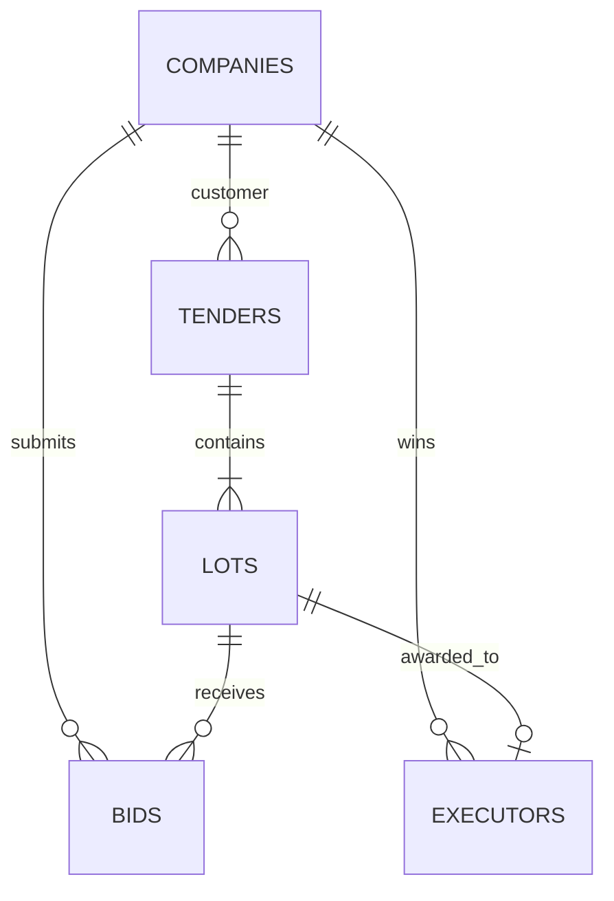

# Tender Platform DB

Проектирование и проверяемая реализация схемы PostgreSQL для мониторинга государственных закупок.

## Результат

Проект содержит пять требуемых бизнес-таблиц:

- `companies` — единый справочник заказчиков, участников и победителей;
- `tenders` — закупки с компанией-заказчиком;
- `lots` — лоты закупок;
- `bids` — версионные ценовые предложения участников;
- `executors` — результаты присуждения лотов компаниям.

`executors` является источником истины для победителя и присуждённой суммы. Реквизиты организации не дублируются в отдельном справочнике исполнителей.



## Структура

```text
sql/
  tender_platform.sql
  01_schema.sql
  02_sample_data.sql
  analytics/
    01_top_companies_previous_month.sql
    02_customer_efficiency.sql
scripts/
  test.ps1
tests/
  01_schema_contract.sql
  02_constraints.sql
  03_fixture_contract.sql
  04_analytics_contract.sql
```

## Требования

- PostgreSQL 16 или новее;
- для автоматической проверки: Docker и PowerShell 7.

Скрипты используют стандартные возможности PostgreSQL 16 и не требуют дополнительных расширений.
Полный набор автоматических проверок выполнен на PostgreSQL 16 и PostgreSQL 18.

## Быстрая проверка через Docker

Из корня проекта:

```powershell
.\scripts\test.ps1
```

Скрипт:

1. запускает временный контейнер `postgres:16-alpine`;
2. разворачивает схему в чистой базе;
3. проверяет таблицы, PK, FK, уникальность, типы и индексы;
4. доказывает отклонение некорректных данных;
5. загружает воспроизводимые примеры;
6. запускает и проверяет оба сдаваемых аналитических запроса;
7. удаляет только созданный им контейнер.

## Ручной запуск через psql

В заранее созданной пустой базе:

```powershell
psql -v ON_ERROR_STOP=1 -f sql/tender_platform.sql
```

Единый входной скрипт создаёт схему, таблицы, ограничения, индексы и два аналитических представления. Демонстрационные данные намеренно не входят в производственное развёртывание. Для просмотра проверочного результата после установки:

```powershell
psql -v ON_ERROR_STOP=1 -f sql/02_sample_data.sql
psql -v ON_ERROR_STOP=1 -f sql/analytics/01_top_companies_previous_month.sql
psql -v ON_ERROR_STOP=1 -f sql/analytics/02_customer_efficiency.sql
```

`tender_platform.sql` намеренно предназначен для чистой базы: повторный запуск без удаления схемы завершится ошибкой, защищая существующие данные от неявной перезаписи.

## Целостность данных

Схема включает:

- `bigint GENERATED ALWAYS AS IDENTITY` и PK у каждой таблицы;
- шесть внешних ключей с `ON DELETE RESTRICT`;
- уникальность ИНН, внешнего идентификатора тендера, номера лота внутри тендера и версии ставки участника;
- один результат присуждения на лот в версии 1;
- проверки непустых идентификаторов и названий;
- неотрицательные денежные суммы `numeric(20,2)`;
- контролируемые статусы через именованные `CHECK`;
- временные значения `timestamptz`;
- индексы для FK-соединений, активных тендеров, ставок и отчётов по присуждениям.

Исторические закупочные данные не удаляются каскадно. Если запись уже связана с тендером, лотом, ставкой или результатом, удаление родительской записи должно быть явным и контролируемым.

## Аналитический запрос 1

[`01_top_companies_previous_month.sql`](sql/analytics/01_top_companies_previous_month.sql) выводит три компании с максимальной суммой присуждённых лотов за предыдущий полностью завершённый календарный месяц.

Правила:

- границы месяца рассчитываются в часовом поясе `Europe/Moscow`;
- используется полуоткрытый интервал `[начало прошлого месяца; начало текущего месяца)`;
- прекращённые результаты не учитываются;
- сумма берётся из `executors.awarded_amount`, а не из начальной цены;
- лоты и уникальные тендеры считаются отдельно;
- разные валюты не складываются — топ формируется отдельно для каждой валюты;
- `row_number()` и ID компании обеспечивают ровно три детерминированные строки на валюту.

Запрос создаёт представление `tender_platform.v_top_companies_previous_month` и выводит его содержимое.

## Аналитический запрос 2

[`02_customer_efficiency.sql`](sql/analytics/02_customer_efficiency.sql) рассчитывает эффективность заказчиков за последние шесть полностью завершённых месяцев:

- количество завершённых лотов;
- среднее число допущенных участников на лот;
- начальную и присуждённую суммы;
- абсолютную и процентную экономию;
- место заказчика внутри месяца и валюты.

Ставки сначала агрегируются на уровне лота с `count(DISTINCT bidder_company_id)`. Благодаря этому версии одной заявки не считаются разными участниками, а соединение со ставками не размножает денежные суммы.

Запрос создаёт представление `tender_platform.v_customer_efficiency_last_six_months` и выводит его содержимое.

## Принятые допущения версии 1

- у тендера один заказчик;
- у каждого тендера есть минимум один лот;
- у лота не более одного действующего исполнителя;
- одна компания может подавать несколько версий ставки;
- победа определяется датой присуждения лота;
- выигранная сумма — присуждённая сумма, а не фактические платежи;
- отчётный часовой пояс — `Europe/Moscow`;
- суммы разных валют анализируются раздельно.

## Лицензия

[MIT](LICENSE), © 2026 DokPlay.
