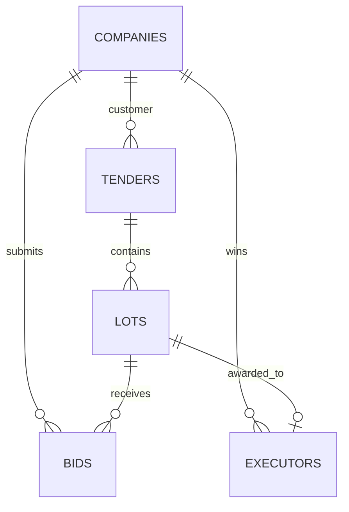

[English version](README.md)

# Tender Platform DB

Проектирование и проверяемая реализация схемы PostgreSQL для мониторинга государственных закупок.

## Результат

Проект содержит пять требуемых бизнес-таблиц:

- `companies` — единый справочник заказчиков, участников и победителей;
- `tenders` — закупки с компанией-заказчиком;
- `lots` — лоты закупок;
- `bids` — версионные ценовые предложения участников;
- `executors` — результаты присуждения лотов компаниям.

`executors` является источником истины для победителя и присуждённой суммы. Реквизиты организации не дублируются в отдельном справочнике исполнителей.



## Структура

```text
sql/
  tender_platform.sql
  01_schema.sql
  02_sample_data.sql
  analytics/
    01_top_companies_previous_month.sql
    02_customer_efficiency.sql
scripts/
  test.ps1
tests/
  fixtures/
    failing_analytics.sql
  01_schema_contract.sql
  02_constraints.sql
  03_fixture_contract.sql
  04_analytics_contract.sql
  05_cancelled_award_contract.sql
  06_exact_ranking_contract.sql
  07_boundary_currency_contract.sql
  08_latest_bid_version_contract.sql
  09_six_month_boundary_contract.sql
  10_zero_price_contract.sql
  11_status_isolation_contract.sql
  12_data_hygiene_defaults_contract.sql
  13_lifecycle_contract.sql
  14_average_rounding_contract.sql
  15_top_exact_money_contract.sql
```

## Требования

- PostgreSQL 16 или новее;
- для автоматической проверки: Docker и PowerShell 7.

Скрипты используют стандартные возможности PostgreSQL 16 и не требуют дополнительных расширений.
Полный набор автоматических проверок выполнен на PostgreSQL 16 и PostgreSQL 18.

## Быстрая проверка через Docker

Из корня проекта:

```powershell
.\scripts\test.ps1
```

Скрипт:

1. запускает временный контейнер `postgres:16-alpine`;
2. разворачивает схему в чистой базе;
3. проверяет все обязательные колонки, типы, значения по умолчанию, `NOT NULL`, `GENERATED ALWAYS`, PK, бизнес-ограничения, ровно шесть FK, рабочие индексы и lifecycle-триггеры;
4. доказывает отклонение некорректных данных, включая отрицательные суммы и `NaN`;
5. загружает воспроизводимые примеры;
6. запускает и проверяет оба сдаваемых аналитических запроса;
7. проверяет отменённые и прекращённые результаты, независимые статусы тендера и лота, имена компаний, точные суммы с копейками, нулевые присуждения, равные рейтинги, `NULLS LAST`, последнюю версию ставки, источник отчётного месяца, округление среднего, валюты и границы периодов;
8. проверяет весь набор Unicode White_Space, конечность временных значений, бизнес-значения по умолчанию, итоговое состояние отложенных lifecycle-ограничений и межтабличные сроки ставок и присуждений;
9. в двух параллельных сессиях воспроизводит конкурентное изменение дедлайна и присуждение, подтверждая сохранение целостности;
10. на 60 000 лотов и 240 000 ставок анализирует JSON-планы: диапазон по `awarded_at` должен оставаться условием индекса, а допущенные ставки читаться покрывающим `Index Only Scan` без обращений к heap;
11. доказывает, что внутренний компонент схемы нельзя запустить напрямую и оставить таблицы в `public`;
12. намеренно ломает второй этап установки и доказывает полный откат, а также безопасный отказ повторной clean-only установки без потери существующих данных;
13. удаляет только созданный им контейнер.

## Ручной запуск через psql

В заранее созданной пустой базе:

```powershell
psql -v ON_ERROR_STOP=1 -f sql/tender_platform.sql
```

Единый входной скрипт в одной транзакции создаёт схему, таблицы, ограничения, индексы и два аналитических представления. Ошибка любого этапа откатывает установку целиком. Демонстрационные данные намеренно не входят в производственное развёртывание. Для просмотра проверочного результата после установки:

```powershell
psql -v ON_ERROR_STOP=1 -f sql/02_sample_data.sql
psql -v ON_ERROR_STOP=1 -f sql/analytics/01_top_companies_previous_month.sql
psql -v ON_ERROR_STOP=1 -f sql/analytics/02_customer_efficiency.sql
```

`tender_platform.sql` намеренно предназначен для чистой базы: повторный запуск без удаления схемы завершится ошибкой, защищая существующие данные от неявной перезаписи.
`01_schema.sql` является внутренним компонентом и защищён от прямого запуска: использовать нужно только единый входной скрипт выше.

## Целостность данных

Схема включает:

- `bigint GENERATED ALWAYS AS IDENTITY` и PK у каждой таблицы;
- шесть внешних ключей с `ON DELETE RESTRICT`;
- уникальность ИНН, пары «источник + внешний ID» тендера, номера лота внутри тендера и версии ставки участника;
- один результат присуждения на лот в версии 1;
- обязательную дату завершения завершённого тендера не раньше окончания приёма заявок;
- проверки непустых идентификаторов и названий, а также запрет ведущих и замыкающих Unicode-пробелов;
- неотрицательные денежные суммы `numeric(20,2)` с явным запретом `NaN`;
- контролируемые статусы через именованные `CHECK`;
- конечные временные значения `timestamptz` без `infinity` и `-infinity`;
- отложенные constraint-триггеры проверяют итоговое состояние строки: ставка должна находиться между публикацией и дедлайном, а присуждение — не раньше дедлайна; обратные изменения дат тендера и принадлежности лота перепроверяют существующие дочерние записи;
- индексы для FK-соединений, активных тендеров, ставок и отчётов по присуждениям;
- компактный покрывающий частичный индекс только по допущенным ставкам для аналитики конкуренции.

Исторические закупочные данные не удаляются каскадно. Если запись уже связана с тендером, лотом, ставкой или результатом, удаление родительской записи должно быть явным и контролируемым.

## Аналитический запрос 1

[`01_top_companies_previous_month.sql`](sql/analytics/01_top_companies_previous_month.sql) выводит три компании с максимальной суммой присуждённых лотов за предыдущий полностью завершённый календарный месяц.

Правила:

- границы месяца рассчитываются в часовом поясе `Europe/Moscow`;
- используется полуоткрытый интервал `[начало прошлого месяца; начало текущего месяца)`;
- прекращённые результаты, отменённые тендеры и отменённые лоты не учитываются;
- сумма берётся из `executors.awarded_amount`, а не из начальной цены;
- лоты и уникальные тендеры считаются отдельно;
- разные валюты не складываются — топ формируется отдельно для каждой валюты;
- `row_number()` и ID компании обеспечивают до трёх детерминированных строк на валюту.

Запрос создаёт представление `tender_platform.v_top_companies_previous_month` и выводит его содержимое.
Имя компании присоединяется после агрегации и ограничения топ-3, поэтому текстовое поле не участвует в промежуточной группировке.

## Аналитический запрос 2

[`02_customer_efficiency.sql`](sql/analytics/02_customer_efficiency.sql) рассчитывает эффективность заказчиков за последние шесть полностью завершённых месяцев:

- количество завершённых лотов;
- среднее число допущенных участников на лот;
- начальную и присуждённую суммы;
- абсолютную и процентную экономию;
- место заказчика внутри месяца и валюты.

Сначала материализуется только набор завершённых лотов отчётного шестимесячного периода. Для каждого участника учитывается статус его версии с максимальным `version_no`: участник считается допущенным, только если эта последняя версия имеет статус `admitted`. Кандидаты и их `version_no` читаются из покрывающего частичного индекса, а наличие более новой версии проверяется уникальным индексом `(lot_id, bidder_company_id, version_no)`. Агрегация выполняется на уровне лота, поэтому версии одной заявки не считаются разными участниками и соединение со ставками не размножает денежные суммы.

Имя заказчика присоединяется после расчёта сумм и рейтинга: широкое текстовое поле не переносится через материализованный набор лотов и не участвует в промежуточной группировке.

Место заказчика рассчитывается по точному проценту экономии. Округление до двух знаков выполняется только для отображения, поэтому близкие значения не меняют правильный порядок рейтинга.

Итоговый вывод полностью детерминирован: `NULL`-рейтинги идут последними, а равенства разрешаются по ID заказчика.

Если суммарная начальная цена группы равна нулю, процент экономии математически не определён: `savings_percent` и `customer_rank` возвращаются как `NULL`, а денежные показатели сохраняются.

Запрос создаёт представление `tender_platform.v_customer_efficiency_last_six_months` и выводит его содержимое.

## Принятые допущения версии 1

- у тендера один заказчик;
- наличие минимум одного лота у тендера обеспечивает загрузчик или приложение; одними FK это правило не выражается;
- у лота не более одного действующего исполнителя;
- одна компания может подавать несколько версий ставки;
- победа определяется датой присуждения лота;
- выигранная сумма — присуждённая сумма, а не фактические платежи;
- отчётный часовой пояс — `Europe/Moscow`;
- суммы разных валют анализируются раздельно.

## Лицензия

[MIT](LICENSE), © 2026 DokPlay.
